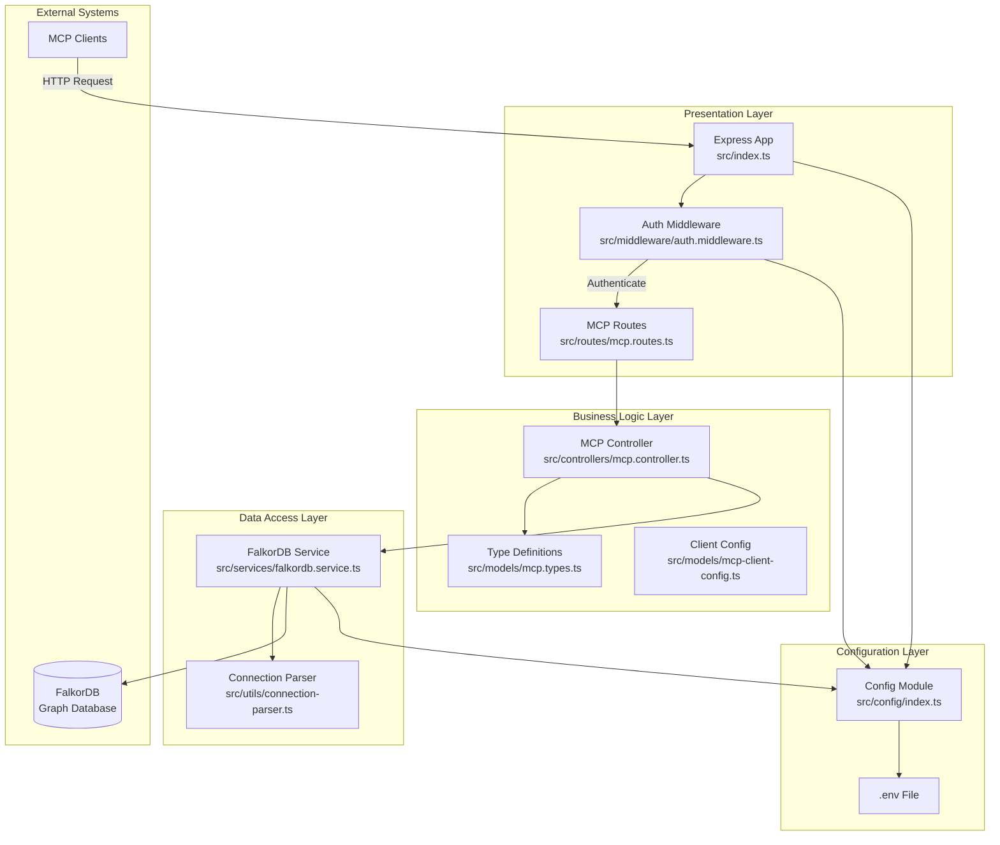
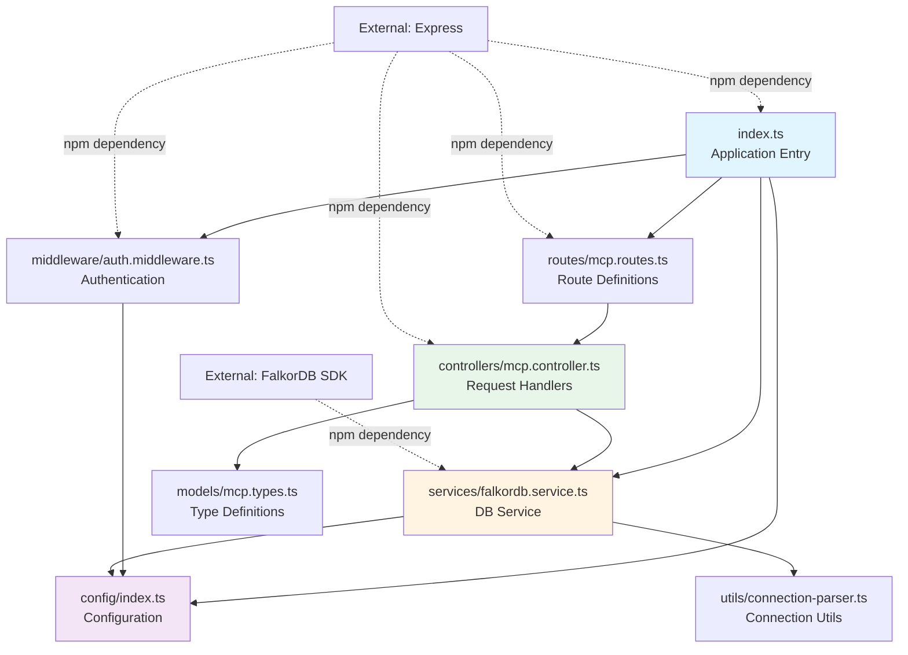
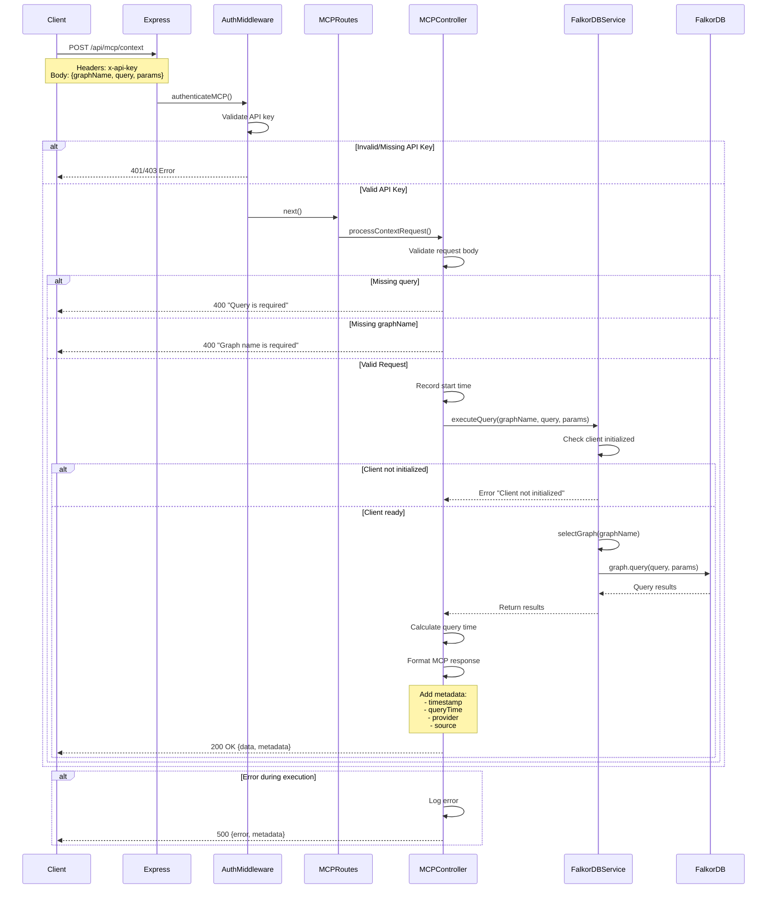

# Repository Architecture Documentation

## Table of Contents
- [Overview](#overview)
- [Quick Start](#quick-start)
- [Architecture Summary](#architecture-summary)
- [Component Overview](#component-overview)
- [Data Flows](#data-flows)
- [API Reference](#api-reference)
- [Development Guide](#development-guide)
- [References](#references)

---

## Overview

### Project Description

The FalkorDB MCP Server is a production-ready TypeScript/Node.js application that implements the Model Context Protocol (MCP) to provide AI models and applications with standardized access to FalkorDB graph databases. It acts as a bridge between MCP clients and FalkorDB instances, exposing a RESTful API that translates MCP requests into FalkorDB operations and formats responses according to MCP specifications.

The system enables AI models to:
- Execute Cypher queries against graph databases
- Discover available graphs and server capabilities
- Retrieve graph metadata and structure information
- Perform graph database operations through a standardized interface

**Primary Users**: AI applications, LLM tools, graph database clients, and developers building graph-based AI solutions.

### Key Features

- **MCP Protocol Compliance**: Full implementation of Model Context Protocol v1.8.0 for standardized graph database access
- **Cypher Query Support**: Execute Cypher queries with parameter support for secure, performant querying
- **Graph Discovery**: List and enumerate available graphs in FalkorDB instances
- **Metadata Services**: Retrieve server capabilities, graph types, and supported query languages
- **Authentication**: API key-based security for all MCP endpoints
- **Docker Ready**: Multi-stage Docker builds for production deployment
- **Connection Management**: Automatic connection retry with health checks
- **Performance Tracking**: Query execution timing and metadata included in all responses
- **Graceful Shutdown**: Proper cleanup of database connections on termination signals
- **TypeScript Type Safety**: Comprehensive type definitions for compile-time validation

### Technology Stack

- **Runtime**: Node.js with TypeScript 5.3.3
- **Framework**: Express.js 4.21.2 (RESTful API server)
- **Database**: FalkorDB 6.2.07 (Graph database)
- **Protocol**: Model Context Protocol (MCP) SDK 1.8.0
- **Testing**: Jest 29.7.0 with TypeScript support
- **Build System**: TypeScript compiler with ES modules
- **Deployment**: Docker with Alpine Linux base images
- **Configuration**: dotenv for environment-based configuration

### Architecture Highlights

- **3-Tier Layered Architecture**: Clean separation between presentation (routes/middleware), business logic (controllers), and data access (services)
- **Singleton Pattern**: Database service and controller use singleton instances for resource efficiency and connection pooling
- **MVC Design Pattern**: Model-View-Controller architecture with Express routing
- **Middleware Pipeline**: Authentication, body parsing, and error handling as composable middleware
- **Type-Safe Design**: Full TypeScript implementation with comprehensive interface definitions
- **Async/Await Pattern**: Modern asynchronous programming throughout the stack
- **Configuration Injection**: Environment-driven configuration with sensible defaults
- **Graceful Degradation**: Service continues operating with database reconnection logic
- **RESTful API Design**: HTTP methods, status codes, and resource-oriented endpoints

**Key Architectural Decisions**:
1. **TypeScript-First**: Chosen for type safety, better IDE support, and reduced runtime errors
2. **Singleton Services**: Single database connection shared across requests for efficiency
3. **MCP Compliance**: Standardized protocol enables broad AI tool compatibility
4. **Express Framework**: Mature, well-supported framework with extensive middleware ecosystem
5. **Environment Configuration**: 12-factor app principles for deployment flexibility

---

## Quick Start

### For New Developers

#### Understanding the Codebase

1. **Start here**: Read this README to understand the overall architecture
2. **Read first**: [Architecture Diagrams](diagrams/02_architecture_diagrams.md) for visual system structure
3. **Explore**: Follow this path through the code:
   - `src/index.ts` - Application entry point
   - `src/routes/mcp.routes.ts` - API endpoints
   - `src/controllers/mcp.controller.ts` - Request handling
   - `src/services/falkordb.service.ts` - Database operations
   - `src/models/mcp.types.ts` - Type definitions

#### Documentation Navigation

- **Component Inventory** → [docs/01_component_inventory.md](docs/01_component_inventory.md) - Understand what each component does, detailed API surface
- **Architecture Diagrams** → [diagrams/02_architecture_diagrams.md](diagrams/02_architecture_diagrams.md) - Visualize system structure, dependencies, and deployment
- **Data Flows** → [docs/03_data_flows.md](docs/03_data_flows.md) - See how data moves through the system with sequence diagrams
- **API Reference** → [docs/04_api_reference.md](docs/04_api_reference.md) - Detailed API documentation with examples and best practices

#### Running the Project

```bash
# Install dependencies
npm install

# Set up environment variables
cp .env.example .env
# Edit .env with your FalkorDB connection details and API key

# Development mode (with hot reload)
npm run dev

# Build for production
npm run build

# Run production build
npm start

# Run tests
npm test

# Run tests with coverage
npm run test:coverage

# Lint code
npm run lint
```

**Docker Deployment**:
```bash
# Build Docker image
docker build -t falkordb-mcpserver .

# Run container
docker run -d \
  --name falkordb-mcp \
  -p 3000:3000 \
  -e FALKORDB_HOST=host.docker.internal \
  -e FALKORDB_PORT=6379 \
  -e MCP_API_KEY=your-api-key \
  falkordb-mcpserver

# Or use environment file
docker run -d \
  --name falkordb-mcp \
  -p 3000:3000 \
  --env-file .env \
  falkordb-mcpserver
```

---

## Architecture Summary

### System Architecture

The FalkorDB MCP Server follows a classic 3-tier layered architecture with clear separation of concerns:



### Architectural Layers

The system is organized into distinct layers, each with specific responsibilities:

#### 1. Presentation Layer

**Purpose**: Handle HTTP requests, authentication, and response formatting

**Components**:
- Express application (`src/index.ts`) - Server initialization and lifecycle management
- MCP routes (`src/routes/mcp.routes.ts`) - Endpoint definitions
- Auth middleware (`src/middleware/auth.middleware.ts`) - API key validation

**Responsibilities**:
- Accept and parse HTTP requests
- Authenticate requests via API key
- Route requests to appropriate controllers
- Format and send HTTP responses
- Handle server lifecycle (startup, shutdown)

**Key Files**:
- `src/index.ts` (lines 8-48)
- `src/routes/mcp.routes.ts` (lines 5-16)
- `src/middleware/auth.middleware.ts` (lines 7-25)

#### 2. Business Logic Layer

**Purpose**: Process MCP requests, validate input, and format responses

**Components**:
- MCP Controller (`src/controllers/mcp.controller.ts`) - Request processing and response formatting
- Type definitions (`src/models/mcp.types.ts`) - MCP protocol type contracts
- Client config types (`src/models/mcp-client-config.ts`) - Configuration templates

**Responsibilities**:
- Validate request structure and parameters
- Coordinate between routes and services
- Format data according to MCP specifications
- Add metadata (timestamps, query times, provider info)
- Handle errors and return appropriate HTTP status codes

**Key Files**:
- `src/controllers/mcp.controller.ts` (lines 10-116)
- `src/models/mcp.types.ts` (lines 5-38)

#### 3. Data Access Layer

**Purpose**: Manage FalkorDB connections and execute database operations

**Components**:
- FalkorDB Service (`src/services/falkordb.service.ts`) - Database connection and query execution
- Connection parser (`src/utils/connection-parser.ts`) - Parse connection strings

**Responsibilities**:
- Establish and maintain database connections
- Execute Cypher queries against FalkorDB
- List available graphs
- Handle database errors
- Implement connection retry logic
- Gracefully close connections

**Key Files**:
- `src/services/falkordb.service.ts` (lines 4-76)
- `src/utils/connection-parser.ts` (lines 5-50)

#### 4. External Systems

**Database**: FalkorDB graph database (default port 6379)
- Stores and queries graph data
- Executes Cypher queries
- Provides graph listing capabilities

**Clients**: MCP-compliant applications
- AI models and LLM tools
- Graph database clients
- Custom applications using MCP protocol

### Design Patterns

| Pattern | Usage | Location | Purpose |
|---------|-------|----------|---------|
| Singleton | Service and controller instances | `falkordb.service.ts:76`, `mcp.controller.ts:116` | Share single database connection and controller instance across all requests |
| MVC | Overall architecture | Routes → Controllers → Services | Separate routing, business logic, and data access concerns |
| Middleware Pipeline | Express middleware chain | `index.ts:11-15`, `auth.middleware.ts:7` | Composable request processing (body parsing, authentication) |
| Dependency Injection | Module imports | Throughout codebase | Provide dependencies (config, services) to components |
| Factory (implicit) | Service initialization | `falkordb.service.ts:7-9` | Automatic service setup on import |
| Strategy (implicit) | Environment-based config | `config/index.ts:6-20` | Different configurations for dev/production |

### Key Architectural Decisions

1. **TypeScript Over JavaScript**
   - **Decision**: Use TypeScript exclusively for application code
   - **Rationale**: Compile-time type checking reduces runtime errors, improves IDE support, and serves as self-documenting code
   - **Impact**: Better maintainability, fewer bugs, improved developer experience
   - **Trade-off**: Additional build step, but benefits far outweigh the cost

2. **Singleton Service Pattern**
   - **Decision**: Export singleton instances of services and controllers
   - **Rationale**: Single database connection shared across requests reduces connection overhead and resource usage
   - **Impact**: Efficient resource utilization, simplified state management
   - **Trade-off**: Testing requires mock setup, but Jest makes this straightforward

3. **MCP Protocol Compliance**
   - **Decision**: Implement full Model Context Protocol specification
   - **Rationale**: Standardized interface enables compatibility with wide range of AI tools and LLM applications
   - **Impact**: Broader ecosystem compatibility, future-proof design
   - **Trade-off**: Must adhere to protocol structure, but provides clear contract

4. **Environment-Based Configuration**
   - **Decision**: All configuration via environment variables with defaults
   - **Rationale**: Follows 12-factor app principles, enables different configs for dev/staging/production without code changes
   - **Impact**: Flexible deployment, no secrets in code, easy CI/CD integration
   - **Trade-off**: Requires .env file management, but standard practice

5. **Express.js Framework Choice**
   - **Decision**: Use Express.js for HTTP server
   - **Rationale**: Mature ecosystem, extensive middleware, well-documented, large community
   - **Impact**: Rapid development, reliable performance, easy to find developers
   - **Trade-off**: Not as modern as Fastify, but stability and ecosystem win

6. **Automatic Connection Retry**
   - **Decision**: Retry database connections every 5 seconds on failure
   - **Rationale**: Handles temporary network issues, database restarts gracefully
   - **Impact**: Improved reliability, self-healing behavior
   - **Trade-off**: Delayed startup if database unavailable, but acceptable for resilience

---

## Component Overview

### Component Map

```
FalkorDB-MCPServer/
├── src/
│   ├── index.ts - Application entry point, server lifecycle management
│   ├── config/
│   │   └── index.ts - Centralized configuration from environment variables
│   ├── controllers/
│   │   ├── mcp.controller.ts - MCP request handlers (query, metadata, list)
│   │   └── mcp.controller.test.ts - Controller unit tests
│   ├── middleware/
│   │   └── auth.middleware.ts - API key authentication middleware
│   ├── models/
│   │   ├── mcp.types.ts - MCP protocol type definitions
│   │   └── mcp-client-config.ts - Client/server configuration types
│   ├── routes/
│   │   └── mcp.routes.ts - REST API route definitions
│   ├── services/
│   │   ├── falkordb.service.ts - FalkorDB connection and query service
│   │   └── falkordb.service.test.ts - Service unit tests
│   └── utils/
│       └── connection-parser.ts - Parse FalkorDB connection strings
├── .env.example - Example environment configuration
├── Dockerfile - Multi-stage Docker build
├── package.json - Dependencies and scripts
├── tsconfig.json - TypeScript compiler configuration
└── README.md - Project documentation
```

### Core Components

#### 1. Application Entry Point (`index.ts`)

- **File**: `src/index.ts`
- **Purpose**: Initialize Express application, configure middleware, register routes, manage server lifecycle
- **Key Methods/Functions**:
  - Express app initialization (line 8)
  - Middleware registration (lines 11-12): JSON and URL-encoded body parsing
  - Route mounting (line 15): MCP routes with authentication
  - Root health endpoint (lines 18-24): Server status information
  - Server startup (lines 27-31): Bind to configured port
  - Graceful shutdown handlers (lines 34-46): SIGTERM and SIGINT cleanup
- **Dependencies**: express, config, routes, middleware, services
- **Used By**: Node.js runtime as entry point

#### 2. FalkorDB Service (`falkordb.service.ts`)

- **File**: `src/services/falkordb.service.ts`
- **Purpose**: Manage FalkorDB database connections and execute graph operations
- **Key Methods/Functions**:
  - `constructor()` (line 7): Initialize service and start connection
  - `init()` (line 11): Connect to FalkorDB with retry logic
  - `executeQuery(graphName, query, params)` (line 33): Execute Cypher queries
  - `listGraphs()` (line 53): Retrieve available graphs
  - `close()` (line 67): Gracefully close database connection
- **Dependencies**: falkordb (FalkorDB client), config
- **Used By**: MCP Controller for all database operations
- **Singleton Export**: `falkorDBService` instance (line 76)

#### 3. MCP Controller (`mcp.controller.ts`)

- **File**: `src/controllers/mcp.controller.ts`
- **Purpose**: Handle MCP protocol requests, validate input, format responses
- **Key Methods/Functions**:
  - `processContextRequest(req, res)` (line 14): Execute graph queries
  - `processMetadataRequest(req, res)` (line 64): Return server capabilities
  - `listGraphs(req, res)` (line 90): List available graphs
- **Dependencies**: express (Request/Response types), falkorDBService, mcp.types
- **Used By**: MCP routes for all endpoint handling
- **Singleton Export**: `mcpController` instance (line 116)

#### 4. Authentication Middleware (`auth.middleware.ts`)

- **File**: `src/middleware/auth.middleware.ts`
- **Purpose**: Validate API keys for MCP endpoint access
- **Key Methods/Functions**:
  - `authenticateMCP(req, res, next)` (line 7): Check API key from header or query param
- **Dependencies**: express (middleware types), config
- **Used By**: Applied to all `/api/mcp/*` routes in index.ts
- **Security Features**: Development mode bypass with warning, clear error responses (401/403)

#### 5. MCP Routes (`mcp.routes.ts`)

- **File**: `src/routes/mcp.routes.ts`
- **Purpose**: Define REST API endpoints and bind to controller methods
- **Key Methods/Functions**: Route definitions:
  - `POST /context` (line 7): Execute graph queries
  - `GET /metadata` (line 8): Get server metadata
  - `GET /graphs` (line 9): List graphs
  - `GET /health` (line 12): Health check
- **Dependencies**: express (Router), mcp.controller
- **Used By**: Main application mounts at `/api/mcp` with authentication

#### 6. Configuration Module (`config/index.ts`)

- **File**: `src/config/index.ts`
- **Purpose**: Centralize environment variable access with defaults
- **Key Methods/Functions**: Export `config` object with:
  - `server`: port (default 3000), nodeEnv (default 'development')
  - `falkorDB`: host, port (6379), username, password
  - `mcp`: apiKey for authentication
- **Dependencies**: dotenv for .env file loading
- **Used By**: index.ts, auth.middleware.ts, falkordb.service.ts

#### 7. MCP Type Definitions (`mcp.types.ts`)

- **File**: `src/models/mcp.types.ts`
- **Purpose**: Define TypeScript interfaces for MCP protocol
- **Key Types**:
  - `MCPContextRequest`: Graph query request structure
  - `MCPOptions`: Query execution options
  - `MCPResponse`: Standard response format with data and metadata
  - `MCPMetadata`: Response metadata (timestamp, queryTime, provider)
  - `MCPProviderMetadata`: Server capabilities and features
- **Dependencies**: None (pure type definitions)
- **Used By**: Controllers for type-safe request/response handling

### Component Dependencies



**Dependency Flow**:
- **No Circular Dependencies**: Clean unidirectional dependency graph
- **Configuration as Foundation**: Config module has no internal dependencies, only dotenv
- **Layered Dependencies**: Higher layers (controllers) depend on lower layers (services), never reversed
- **Minimal External Dependencies**: Only essential packages (Express, FalkorDB SDK, dotenv)

### Public API Surface

The following components form the public API accessible to external clients:

| Component | Type | Purpose | Reference |
|-----------|------|---------|-----------|
| `POST /api/mcp/context` | REST Endpoint | Execute Cypher queries against graphs | [API Ref](docs/04_api_reference.md#post-apimcpcontext) |
| `GET /api/mcp/metadata` | REST Endpoint | Retrieve server capabilities | [API Ref](docs/04_api_reference.md#get-apimcpmetadata) |
| `GET /api/mcp/graphs` | REST Endpoint | List available graphs | [API Ref](docs/04_api_reference.md#get-apimcpgraphs) |
| `GET /api/mcp/health` | REST Endpoint | MCP API health check | [API Ref](docs/04_api_reference.md#get-apimcphealth) |
| `GET /` | REST Endpoint | Root server health/info | [API Ref](docs/04_api_reference.md#get-) |
| MCPContextRequest | TypeScript Interface | Query request format | [Component Inv](docs/01_component_inventory.md#mcpcontextrequest) |
| MCPResponse | TypeScript Interface | Standard response format | [Component Inv](docs/01_component_inventory.md#mcpresponse) |
| MCPProviderMetadata | TypeScript Interface | Server metadata format | [Component Inv](docs/01_component_inventory.md#mcpprovidermetadata) |

### Internal Components

Internal components support the public API but are not directly exposed:

- **FalkorDBService** (singleton): Database connection pooling and query execution
- **MCPController** (singleton): Request processing and response formatting
- **authenticateMCP** (middleware): API key validation
- **config** (module): Environment variable management
- **connection-parser** (utility): Parse FalkorDB connection strings (available but not currently used)

---

## Data Flows

### Overview of Data Flows

The system implements 7 main data flow patterns that cover all aspects of operation:

1. **Graph Query Execution Flow** - Process Cypher queries and return results with metadata
2. **Metadata Retrieval Flow** - Return server capabilities without database interaction
3. **Graph Listing Flow** - Enumerate available graphs from FalkorDB
4. **Authentication Flow** - Validate API keys before processing requests
5. **Error Handling Flow** - Catch, log, and return errors at multiple layers
6. **Database Connection Management Flow** - Initialize, maintain, and close database connections
7. **Server Lifecycle Flow** - Application startup, operation, and graceful shutdown

### Key Flow Pattern: Graph Query Execution

This is the primary data flow for executing Cypher queries against FalkorDB graphs:



**Flow Summary**:
1. Client sends POST request to `/api/mcp/context` with API key, graph name, and Cypher query
2. Authentication middleware validates API key (returns 401/403 if invalid)
3. Router forwards to controller's `processContextRequest` method
4. Controller validates required fields (query and graphName)
5. Controller records start time and calls FalkorDB service
6. Service checks connection is initialized and executes query
7. Controller calculates execution time and formats MCP response
8. Response includes query results and metadata (timestamp, queryTime, provider, source)
9. Errors at any stage are caught, logged, and returned with appropriate HTTP status

**Key Points**:
- **Multi-layer validation**: API key, then request structure, then database readiness
- **Performance tracking**: Every query timed and included in response metadata
- **Security**: Parameterized queries supported to prevent injection attacks
- **Error transparency**: Clear error messages with context for debugging
- **MCP compliance**: Response format follows protocol specification

### Request Lifecycle

A typical request flows through these stages:

```
[Client Request]
    → [Express Body Parsing]
    → [Authentication Middleware]
    → [Route Matching]
    → [Controller Validation]
    → [Service Layer Processing]
    → [Database Operation]
    → [Response Formatting]
    → [Metadata Addition]
    → [Client Response]
```

**Error paths exist at each stage**:
- Authentication failure → 401/403
- Missing parameters → 400
- Database not ready → 500
- Query errors → 500 with details

**Details**: See [Data Flows Documentation](docs/03_data_flows.md) for complete sequence diagrams of all 7 flows.

### Error Handling Patterns

The system implements defense-in-depth error handling at multiple layers:

- **Layer 1 - Authentication**: API key validation before any processing (401/403 errors)
- **Layer 2 - Controller Validation**: Request structure and required field checking (400 errors)
- **Layer 3 - Service Layer**: Database connection and query execution errors (500 errors)
- **Layer 4 - Logging**: All errors logged with sanitized context to prevent injection
- **Layer 5 - Response Formatting**: Consistent error response structure with metadata

**Error Response Format**:
```typescript
{
  "error": "Descriptive error message",
  "metadata": {
    "timestamp": "2025-11-29T17:30:00.000Z"
  }
}
```

**Security Feature**: Graph names sanitized (newlines removed) before logging to prevent log injection attacks.

---

## API Reference

### Quick API Overview

#### REST Endpoints

| Endpoint | Method | Purpose | Auth Required |
|----------|--------|---------|---------------|
| `/` | GET | Server health and version info | No |
| `/api/mcp/context` | POST | Execute Cypher queries on graphs | Yes |
| `/api/mcp/metadata` | GET | Get server capabilities and features | Yes |
| `/api/mcp/graphs` | GET | List available graphs | Yes |
| `/api/mcp/health` | GET | MCP API health check | Yes |

#### Core Services

| Service | Purpose | Key Methods |
|---------|---------|-------------|
| FalkorDBService | Database operations | `executeQuery()`, `listGraphs()`, `close()` |
| MCPController | Request handling | `processContextRequest()`, `processMetadataRequest()`, `listGraphs()` |

#### Configuration

**Essential Environment Variables**:
```env
# Server Configuration
PORT=3000
NODE_ENV=development

# FalkorDB Connection
FALKORDB_HOST=localhost
FALKORDB_PORT=6379
FALKORDB_USERNAME=
FALKORDB_PASSWORD=

# MCP Authentication
MCP_API_KEY=your_api_key_here
```

**For Complete API Documentation**: See [API Reference](docs/04_api_reference.md)

### Usage Examples

#### Example 1: Execute a Graph Query

```bash
curl -X POST http://localhost:3000/api/mcp/context \
  -H "x-api-key: your-api-key" \
  -H "Content-Type: application/json" \
  -d '{
    "graphName": "socialNetwork",
    "query": "MATCH (p:Person)-[:KNOWS]->(f:Person) RETURN p.name, f.name LIMIT 5"
  }'
```

**Response**:
```json
{
  "data": {
    "records": [
      {"p.name": "Alice", "f.name": "Bob"},
      {"p.name": "Alice", "f.name": "Charlie"}
    ]
  },
  "metadata": {
    "timestamp": "2025-11-29T17:30:00.000Z",
    "queryTime": 45,
    "provider": "FalkorDB MCP Server",
    "source": "falkordb"
  }
}
```

#### Example 2: Parameterized Query (Secure)

```bash
curl -X POST http://localhost:3000/api/mcp/context \
  -H "x-api-key: your-api-key" \
  -H "Content-Type: application/json" \
  -d '{
    "graphName": "socialNetwork",
    "query": "MATCH (p:Person {name: $name}) RETURN p",
    "params": {
      "name": "Alice"
    }
  }'
```

**TypeScript Client**:
```typescript
import { MCPContextRequest, MCPResponse } from './models/mcp.types';

async function findPerson(name: string): Promise<MCPResponse> {
  const response = await fetch('http://localhost:3000/api/mcp/context', {
    method: 'POST',
    headers: {
      'x-api-key': 'your-api-key',
      'Content-Type': 'application/json'
    },
    body: JSON.stringify({
      graphName: 'socialNetwork',
      query: 'MATCH (p:Person {name: $name}) RETURN p',
      params: { name }
    })
  });
  return await response.json();
}
```

---

## Development Guide

### Prerequisites

- **Node.js**: v18 or higher
- **npm**: v8 or higher
- **FalkorDB**: Running instance (local or remote)
- **TypeScript**: Installed via npm (included in dev dependencies)
- **Git**: For version control

### Setup Instructions

```bash
# Clone repository
git clone https://github.com/FalkorDB/FalkorDB-MCPServer.git
cd FalkorDB-MCPServer

# Install dependencies
npm install

# Configure environment
cp .env.example .env
# Edit .env with your settings:
#   - Set FALKORDB_HOST and FALKORDB_PORT
#   - Set MCP_API_KEY for authentication
#   - Optionally set PORT (default 3000)

# Run development server (with hot reload)
npm run dev

# Or build and run production
npm run build
npm start
```

### Project Structure

```
FalkorDB-MCPServer/
├── src/                      # Source code
│   ├── index.ts             # Application entry point
│   ├── config/              # Configuration management
│   ├── controllers/         # Request handlers
│   ├── middleware/          # Express middleware (auth)
│   ├── models/              # TypeScript type definitions
│   ├── routes/              # API route definitions
│   ├── services/            # Business logic and data access
│   └── utils/               # Helper utilities
├── dist/                     # Compiled JavaScript (generated)
├── node_modules/             # Dependencies (generated)
├── .env                      # Environment variables (create from .env.example)
├── .env.example              # Example environment configuration
├── Dockerfile                # Docker container definition
├── package.json              # Project metadata and dependencies
├── tsconfig.json             # TypeScript compiler configuration
└── jest.config.js            # Test framework configuration
```

### Development Workflow

1. **Understanding a Feature**:
   - Start with route definition in `src/routes/mcp.routes.ts`
   - Follow to controller in `src/controllers/mcp.controller.ts`
   - Check service implementation in `src/services/falkordb.service.ts`
   - Review type definitions in `src/models/mcp.types.ts`

2. **Making Changes**:
   - Follow existing patterns (singleton services, async/await)
   - Add types for all new functions and interfaces
   - Update tests when modifying behavior
   - Run linter before committing: `npm run lint`

3. **Testing**:
   ```bash
   # Run all tests
   npm test

   # Run tests with coverage
   npm run test:coverage

   # Run specific test file
   npm test -- mcp.controller.test.ts

   # Watch mode for development
   npm test -- --watch
   ```

4. **Common Tasks**:
   - **Add new endpoint**: Update `routes/mcp.routes.ts`, add controller method, update tests
   - **Modify query logic**: Edit `services/falkordb.service.ts`, update tests
   - **Change response format**: Update `models/mcp.types.ts`, modify controller formatting
   - **Add configuration**: Add to `config/index.ts`, document in README

### Best Practices

1. **Code Organization**:
   - Keep controllers thin (validation and formatting only)
   - Put business logic in services
   - Use TypeScript interfaces for all data structures
   - Export singleton instances for services and controllers
   - Organize imports: external, internal, types

2. **Error Handling**:
   - Always use try/catch in async functions
   - Validate input early (fail fast)
   - Use parameterized queries to prevent injection
   - Log errors with context (sanitized for security)
   - Return appropriate HTTP status codes (400, 401, 403, 500)

3. **Security**:
   - Never commit `.env` files
   - Use strong, random API keys in production
   - Always require API keys (no bypass in production)
   - Sanitize user input before logging
   - Use parameterized queries for database operations

4. **Performance**:
   - Use the singleton service pattern (don't create new instances)
   - Add LIMIT clauses to queries
   - Consider query indexing in FalkorDB
   - Monitor query execution times via metadata
   - Close connections gracefully on shutdown

---

## References

### Documentation Index

| Document | Description | When to Read |
|----------|-------------|--------------|
| [Component Inventory](docs/01_component_inventory.md) | Complete list of all components, classes, and functions with line numbers | When you need to find where something is implemented or understand component details |
| [Architecture Diagrams](diagrams/02_architecture_diagrams.md) | Visual representation of system architecture with Mermaid diagrams | When you need to understand system structure, layers, and component relationships |
| [Data Flows](docs/03_data_flows.md) | Detailed sequence diagrams of all 7 data flows in the system | When you need to understand how data moves through the system or debug request flow |
| [API Reference](docs/04_api_reference.md) | Complete API documentation with examples, types, and best practices | When you need detailed information about using the API or integrating with the server |

### Additional Resources

**FalkorDB Resources**:
- [FalkorDB Official Documentation](https://docs.falkordb.com/)
- [FalkorDB GitHub Repository](https://github.com/FalkorDB/FalkorDB)
- [Cypher Query Language Reference](https://neo4j.com/docs/cypher-manual/current/)

**Model Context Protocol**:
- [MCP SDK Documentation](https://github.com/modelcontextprotocol/sdk)
- [MCP Specification](https://spec.modelcontextprotocol.io/)

**Technologies**:
- [Express.js Documentation](https://expressjs.com/)
- [TypeScript Handbook](https://www.typescriptlang.org/docs/)
- [Docker Documentation](https://docs.docker.com/)
- [Jest Testing Framework](https://jestjs.io/)

### Getting Help

**Navigation Tips**:
- **New to the project?** → Start with this README, then [Architecture Diagrams](diagrams/02_architecture_diagrams.md)
- **Looking for a specific component?** → Check [Component Inventory](docs/01_component_inventory.md)
- **Want to understand a workflow?** → See [Data Flows](docs/03_data_flows.md)
- **Need API details?** → Consult [API Reference](docs/04_api_reference.md)
- **Building an integration?** → Start with [API Reference](docs/04_api_reference.md) examples section

**File Paths**:
- All documentation: `ra_output/architecture_20251129_171730/`
- Source code: `src/`
- Tests: `src/**/*.test.ts`

---

## Document Generation Info

**Generated**: 2025-11-29
**Analysis Framework**: Repository Architecture Analysis Suite
**Coverage**: Main project codebase (TypeScript application)

**Excluded from Analysis**:
- `ra_orchestrators/` - Analysis framework code
- `ra_agents/` - Analysis framework code
- `ra_tools/` - Analysis framework code
- `ra_output/` - Generated documentation
- `.venv/` - Python virtual environment
- `node_modules/` - Node.js dependencies

**Analysis Scope**:
- 9 TypeScript source files
- 3 TypeScript test files
- 1 Python file (minimal hello-world entry point)
- Configuration files (package.json, tsconfig.json, Dockerfile)

---

## Summary

This architecture documentation provides a comprehensive view of the **FalkorDB MCP Server** codebase. The system implements a **3-tier layered architecture** (presentation, business logic, data access) with clear separation of concerns.

**Key architectural strengths**:
- **Type Safety**: Full TypeScript implementation with comprehensive interface definitions
- **MCP Compliance**: Standard protocol enables broad AI tool compatibility
- **Clean Architecture**: Layered design with minimal coupling between components
- **Singleton Services**: Efficient resource management with shared database connections
- **Error Handling**: Multi-layer validation and error propagation with clear messages
- **Production Ready**: Docker support, graceful shutdown, connection retry, security
- **Well Tested**: Jest test suite with controller and service coverage
- **Developer Friendly**: Clear code organization, extensive documentation, examples

**Technology Highlights**:
- Modern TypeScript/Node.js stack with Express.js framework
- FalkorDB graph database with Cypher query language support
- Model Context Protocol (MCP) for standardized AI integration
- Environment-based configuration following 12-factor principles
- Docker containerization with multi-stage builds

**Best Use Cases**:
- AI applications requiring graph database access
- LLM tools needing structured graph querying
- Graph-based recommendation systems
- Knowledge graph exploration interfaces
- Social network analysis applications

For detailed information on any aspect of the architecture, consult the referenced documentation files listed in the [References](#references) section above.

---

*This documentation was automatically generated from codebase analysis on 2025-11-29 and represents the architecture as analyzed. For the most current information, refer to the source code and individual documentation files.*
