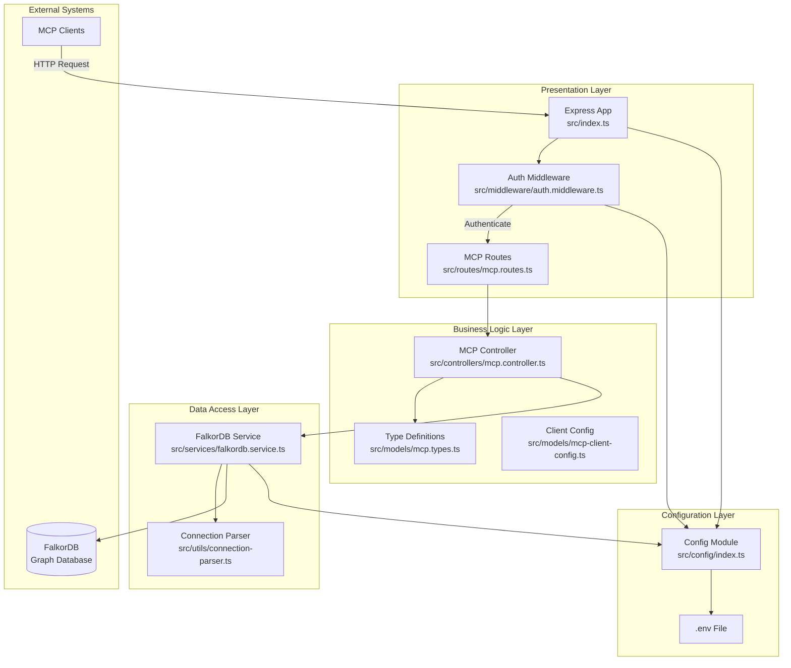
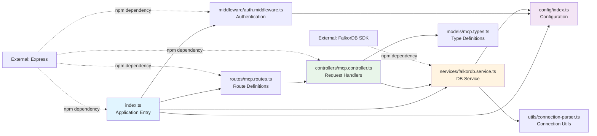
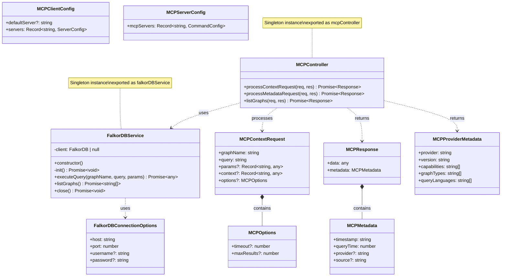
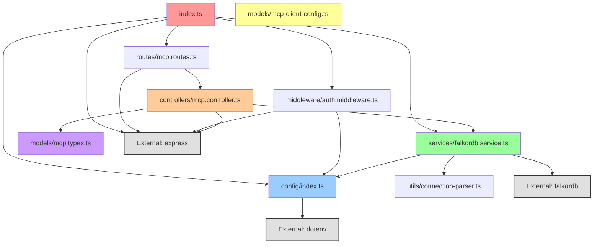
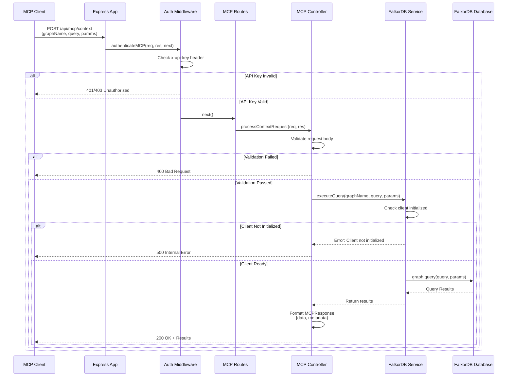
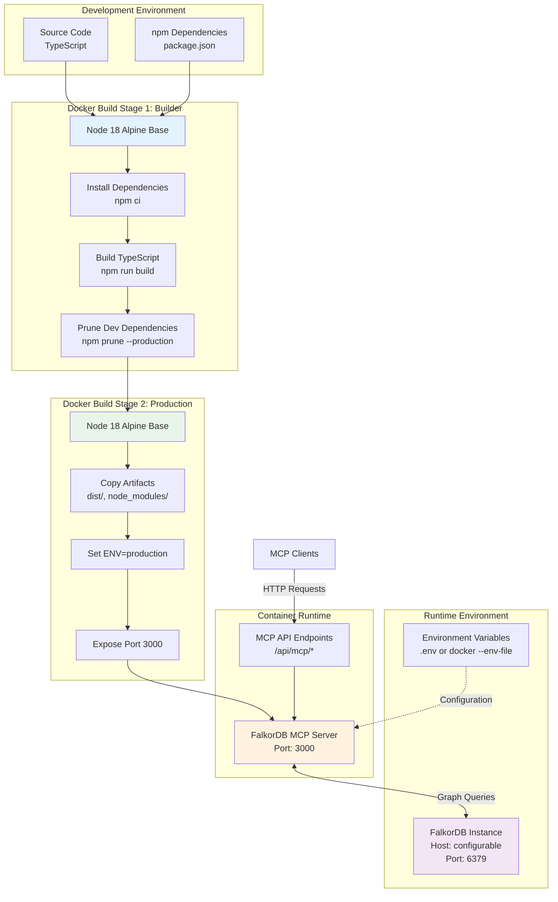
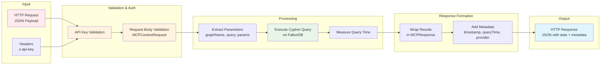
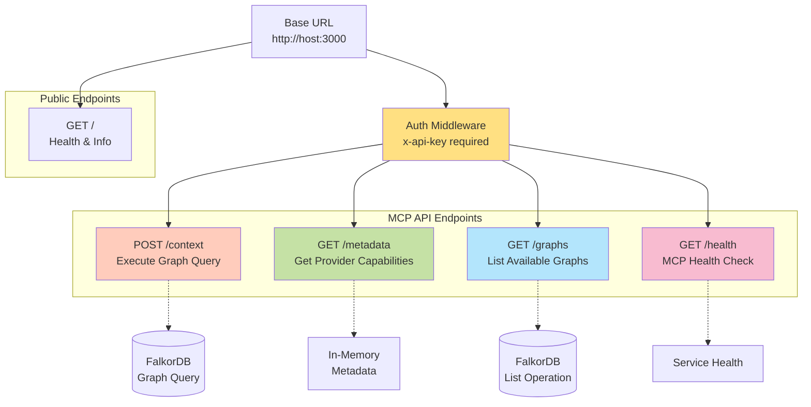

# Architecture Diagrams

## Overview

FalkorDB MCP Server is a TypeScript/Node.js application that implements the Model Context Protocol (MCP) specification to provide a RESTful API interface to FalkorDB, a graph database. The system follows a classic 3-tier architecture pattern with clear separation between presentation (routes), business logic (controllers/services), and data access (FalkorDB service) layers.

The application uses Express.js for HTTP routing, provides authentication middleware, and exposes MCP-compliant endpoints for graph database operations including querying, metadata retrieval, and graph listing.

## 1. System Architecture (Layered View)

### Description

The system follows a classic layered architecture with clear separation of concerns:

- **Presentation Layer**: Express routes and middleware handling HTTP requests/responses
- **Business Logic Layer**: Controllers processing MCP requests and coordinating operations
- **Data Access Layer**: FalkorDB service managing database connections and query execution
- **External Systems**: FalkorDB database and MCP clients

### Key Points

- **Clean Separation**: Each layer has a distinct responsibility with minimal coupling
- **Configuration Management**: Centralized configuration using environment variables via dotenv
- **Authentication**: API key-based authentication enforced at the presentation layer
- **Singleton Pattern**: FalkorDB service uses singleton pattern for connection pooling
- **Type Safety**: Strong TypeScript typing throughout with dedicated type definitions

## 2. Component Relationships

### Description

This diagram shows how major components interact with each other, highlighting the request flow and dependencies between modules.

### Key Points

- **Central Entry Point**: `index.ts` orchestrates application initialization and component wiring
- **Dependency Injection**: Components receive dependencies (like config, services) through imports
- **Route-Controller Pattern**: Routes delegate business logic to controllers
- **Service Layer**: Controllers depend on services for data operations, not direct database access
- **External Dependencies**: Minimal external dependencies (Express, FalkorDB SDK, dotenv)

## 3. Class Hierarchies

### Description

This diagram shows the object-oriented structure of the main classes in the system, their properties, methods, and relationships.

### Key Points

- **Singleton Pattern**: Both `MCPController` and `FalkorDBService` are exported as singleton instances
- **Interface-Based Design**: Heavy use of TypeScript interfaces for type safety and contract definitions
- **Composition**: Complex types like `MCPResponse` compose simpler types like `MCPMetadata`
- **Async Operations**: All service and controller methods are asynchronous returning Promises
- **Type Safety**: Strong typing ensures compile-time validation of data structures

## 4. Module Dependencies

### Description

This diagram shows the import relationships between modules, revealing the dependency structure and potential circular dependencies.

### Key Points

- **No Circular Dependencies**: Clean dependency graph with unidirectional flow
- **Configuration as Foundation**: `config/index.ts` is imported by multiple modules but imports nothing (except dotenv)
- **Layered Dependencies**: Higher layers depend on lower layers, never the reverse
- **External Dependencies**: Only three main external dependencies (dotenv, express, falkordb)
- **Loose Coupling**: `mcp-client-config.ts` is standalone with no dependencies, providing configuration templates

## 5. Sequence Diagram - Typical Request Flow

### Description

This diagram shows the complete lifecycle of a typical graph query request through the system, from client request to database response.

### Key Points

- **Authentication First**: All requests go through API key validation before processing
- **Early Validation**: Request validation happens at controller level before database operations
- **Error Handling**: Multiple error paths with appropriate HTTP status codes (400, 401, 403, 500)
- **Metadata Enrichment**: Controller adds timestamp, query time, and provider information to responses
- **Connection Management**: Service checks client initialization before executing queries
- **Async Flow**: Entire flow is asynchronous with proper error propagation

## 6. Deployment Architecture

### Description

This diagram shows how the system is containerized and deployed using Docker, including the multi-stage build process and runtime configuration.

### Key Points

- **Multi-Stage Build**: Optimizes image size by separating build and runtime dependencies
- **Alpine Base**: Uses lightweight Alpine Linux reducing container size
- **Production Optimization**: Development dependencies removed in production image
- **Port Exposure**: Container exposes port 3000 for HTTP traffic
- **Environment-Based Config**: Supports configuration through environment variables or .env files
- **External Database**: Connects to external FalkorDB instance (not containerized together)
- **Stateless Design**: Application container is stateless, all state in FalkorDB

## 7. Data Flow Architecture

### Description

This diagram illustrates how data flows through the system from external requests to database operations and back.

### Key Points

- **Linear Flow**: Clear unidirectional data flow from input to output
- **Multiple Validation Stages**: API key validation followed by request body validation
- **Metadata Augmentation**: Response enriched with operational metadata (timing, provider info)
- **Type Safety**: Data validated against TypeScript interfaces at each stage
- **Error Propagation**: Errors at any stage short-circuit to error response

## 8. Component Interaction Matrix

### Description

This table shows which components interact with each other and the nature of their interactions.

| Component | Interacts With | Interaction Type | Purpose |
|-----------|----------------|------------------|---------|
| index.ts | config | Import | Load application configuration |
| index.ts | routes/mcp.routes | Import | Mount API routes |
| index.ts | middleware/auth | Import | Apply authentication |
| index.ts | services/falkordb | Import | Graceful shutdown |
| routes/mcp.routes | controllers/mcp | Import | Delegate request handling |
| controllers/mcp | services/falkordb | Import | Execute database operations |
| controllers/mcp | models/mcp.types | Import | Type definitions |
| services/falkordb | config | Import | Database connection config |
| services/falkordb | utils/connection-parser | Import | Parse connection strings |
| middleware/auth | config | Import | Validate API keys |

## 9. API Endpoint Architecture

### Description

This diagram shows the available API endpoints and their relationships.

### Key Points

- **Authentication Boundary**: `/api/mcp/*` routes protected by API key authentication
- **RESTful Design**: Uses appropriate HTTP methods (GET for retrieval, POST for operations)
- **Health Monitoring**: Multiple health check endpoints at different levels
- **MCP Compliance**: Endpoints follow MCP specification patterns
- **Separation of Concerns**: Public vs authenticated endpoints clearly separated

## Summary

The FalkorDB MCP Server architecture demonstrates several strong architectural patterns:

1. **Layered Architecture**: Clear separation between presentation, business logic, and data access layers
2. **Singleton Services**: Database service and controller use singleton pattern for resource efficiency
3. **Middleware Pattern**: Express middleware for cross-cutting concerns like authentication
4. **Type Safety**: Comprehensive TypeScript interfaces ensuring compile-time validation
5. **Configuration Management**: Centralized, environment-based configuration
6. **Error Handling**: Multiple validation points with appropriate error responses
7. **Containerization**: Production-ready Docker configuration with multi-stage builds
8. **MCP Compliance**: Implements Model Context Protocol specification for graph database access

The architecture is well-suited for:
- **Scalability**: Stateless design allows horizontal scaling
- **Maintainability**: Clear module boundaries and minimal coupling
- **Testability**: Dependency injection and layered design facilitate unit testing
- **Security**: API key authentication and input validation at multiple levels
- **Reliability**: Connection retry logic and graceful shutdown handling
